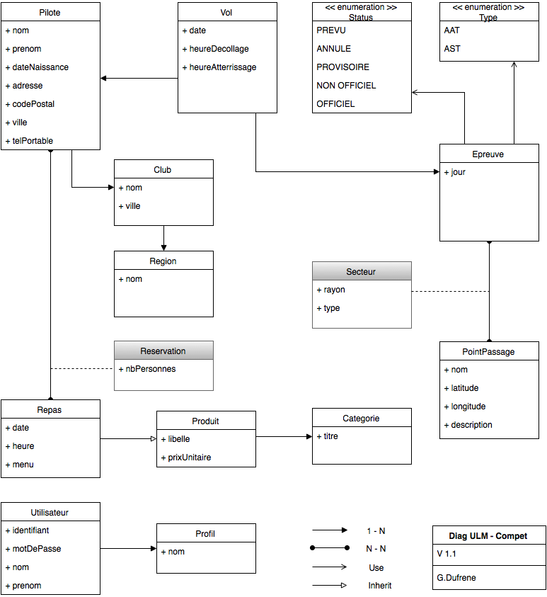

# JPA

## Complétez le modèle

* Reprenez le diagramme UML ci-dessous et compléter les attributs des classes.

L'ensemble des classes sont situées dans le package "fr.eservices.soaring.model".  
Les noms d'attribut devront obligatoirement respecter le diagramme.  

* Lancez le test "ModelAttributes" pour vérifier votre travail.

## Annotations

* Ajoutez une dépendance org.hibernate.javax.persistence :: hibernate-jpa-2.1-api :: 1.0.0.Final
* Ajoutez les annotations JPA nécessaires à la gestion des entités.  
Vous ajouterez des identifiants numériques nommés 'id' à vos entités quand cela est nécessaire.  
Si vous devez spécifier des clé étrangères, nommez les "_id" précédé du nom de l'entité lié, exemple : "club_id".

Le test "JpaAnnotations" devrait vous permettre de vérifier votre travail.

## Contexte

Nous utiliserons une base de données H2.  
H2 est une base compatible SQL écrite en java qui peut s'embarquer facilement et propose un modèle de persistence mémoire qui peut être intéressant pour exécuter des tests unitaires.

* Ajoutez une dépendance maven vers com.h2database :: h2 :: 1.4.193  
Cette dépendance pourra être dans le scope "test".
* Ajoutez une dépendance vers org.hibernate :: hibernate-core :: 5.2.4.Final  
Hibernate implémente les spécification JPA 2.1, en scope "test" également.
* Ecrivez le fichier META-INF/persistence.xml  et faîtes un test de chargement de contexte.  
Le test "JpaContext" charge le persistance unit "myApp".

## DAO / Requêtes

Vous allez implémenter quelques requêtes de sélection avec des critères.  
Pour la liste des places disponibles à un repas : on supposera que le nombre de couverts possible pour tous les repas est égal à 20.  
On déduira les réservations déjà effectuées par repas, évidemment.

* En utilisant l'entity manager de JPA, implémentez "RegistrationDao".
* Implémentez RegistrationDaoFactory, il est utilisé pour les tests.
* Lancer RegistrationDaoTest pour vérifier votre travail.

